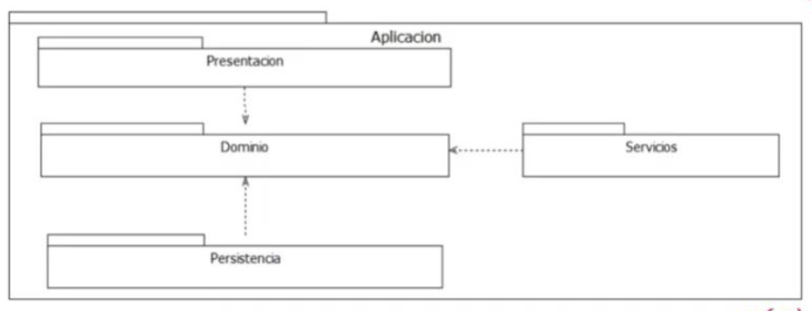

# Steps needed to configuring the reference architecture 

The reference architecture that we going to implement is the one what is shown in the next figure



All steps follow in this notes aiming to build a project named TorneoFutbol, but the steps are the same for whichever sort of project

<h2>1. Creating the folders</h2>

As we can see in the before picture all layers point to Dominio layer, which is the layer that contains the logical business

In ASP.NET each layer must have a specific so that the layer will be construct like the following types

**Application** type solution, for creating one layer of this type, typing the following command in the cmd `dotnet new sln -o TorneoFutbol.App `

**Presentation** type razor project, this is a library of this framework what will help us with the construction of the visual part of our web page, in others  words this is the one what will help us with the front-end part.

**Dominio**: is a classlib and contains all business's classes a project of this type is built with the following command  `dotnet new classlib -o TorneoFutbol.App.Dominio` 

**Persistencia** This layer will interact and serve as a bridge between the classes created in the Dominio layer and the databases, this layer is going to be built as a classlib type, the following is the command to creating the layer `dotnet new classlib -o TorneoFutbol.App.Persistencia`

<h2>Implementing the Dominio Layer</h2>

As in the previous step we created all folder needed to wrap up the classes we are ready to begin the implementation of each layer, in this layer as we previously said this one contains the logical business, as the classes must be related is good idea design that relationships with a diagram class, the following is the one created for our project TorneoFutbol


Although is no needed we will create a new folder within the Dominio this folder will named Entidades and will contains all classes shown in the UML diagram

<h2>2. Implementing the Persistencia Layer</h2>

In this project we will use a ORM (object relational mapper) to deal with the database, as we are working with ASP.NET the ORM we will use is **Entity Framework** but before of can use it is needed to do some configuration issues 

The first step in this configuration is installing the Entity Framework, to achieve it, we need to move to root folder of the project, in this case *ToneoFutbol* then typing the following commands on the shell

`dotnet tool install --global dotnet-ef`
`dotnet tool update --global dotnet-ef`

When the before libraries are installed, we need to move to **Persisitencia** and implement some packets that will deal with the database, such packets are imported by typing the following commands.

```
dotnet add package Microsoft.EntityFrameworkCore --version 5.0.0
dotnet add package Microsoft.EntityFrameworkCore.Tools --version 5.0.0
dotnet add package Microsoft.EntityFrameworkCore.Design --version 5.0.0
dotnet add package Microsoft.EntityFrameworkCore.SqlServer --version 5.0.0 
```

**Warning:** Make sure TargetFramework is configured as `standardnet2.1` otherwise might generate some compatibility problems

In our architecture we will create 2 folder to allocate other configurations, the folders will be `AppRepositorios` and `AppData`.

Inside of *AppRepositorios* we need to create a class called **AppContext.cs** which will deal with the database creation

The AppContex.cs class roughly has the following structure

```C#
using Microsoft.EntityFrameworkCore;
namespace TorneoFutbol.App.Persistencia
{
   public class AppContext : 
   {
       public DbSet<Persona> Personas {get; set;}
       public DbSet<Arbitro> Arbitros {get; set;}
       public DbSet<DirectorTecnico> DirectorTecnicos {get; set;}
       public DbSet<Jugador> Jugadores {get; set;}
       public DbSet<Equipo> Equipos {get; set;}
       public DbSet<Municipio> Municipios {get; set;}
       public DbSet<Estadio> Estadios {get; set;}
       public DbSet<Partido> Partidos {get; set;}
       public DbSet<Novedad> Novedades {get; set;}
       public DbSet<Desempenio> Desempenios {get; set;}


       protected override void OnConfiguring (DbContextOptionsBuilder optionsBuilder)
       {
           if (!optionsBuilder.IsConfigured)
           {
               optionsBuilder.UseSqlServer("Data Source=(localdb)\\MSSQLLocalDB;Initial Catalog=RetoTorneoFutbolData");
           }
                                                                                                                                                                        }
                                                                                                                                                                    }
                                                                                                                                                              }

```
As Appcontext make use of the classes within Persistencia is need to create a reference that pointing to Dominio layer, this is doing by typing `dotnet add reference ..\TorneoFutbol.App.Dominio`

**Warning:** Although the reference to Dominio was made is needed to making sure that the class has `using TorneoFutbol.App.Dominio;` since the class is using classes within Dominio namespace

<h2>3. Implementing the presentation Layer</h2>

Until this point we aren't created a layer that can interact with the database and the domino's classes normally this layer contain the front-end of the web page, but for now we going to create a presentation layer as a console.

To creating a console layer we need to move to TorneoFutbol.App and typing the following command `dotnet new console -o TorneoFutbol.App.Consola`

The before command will create a consola project what will allows to manipulate the other layers from the console, but before we can dealing with it, is needed to setting up the console.

The Consola layer will be configurated with the following steps:

1. Importing the design entity framework by typing `dotnet add package Microsoft.EntityFrameworkCore.Design --version 5.0.0`

2. Creating the reference pointing to Persistencia layer by typing `dotnet add reference ..\TorneoFutbol.App.Persistencia`

3. Calling to Dominio by typing `using TorneoFutbol.App.Dominio;` at the top of script created in Console.

<h2>Creating the migration</h2>

The migration is the process to generating a script that will transform the classes previously created to a Entity Relation model and afterwards creating the database automatically.

To achieving that we will follow the next steps

1. Moving to Persistencia layer
2. Typing the following command will generate a script named Migrations that contains some instructions that later will be used to create a database `dotnet ef migrations add Initial --startup-project ..\TorneoFutbol.App.Consola\`
3. If the previous step runs without problems we are ready to generate the database, until this point we are use a local database, then we need to go to database manager and create new connection, and in server space is needed filling it out with `(localdb)\MSSQLLocalDB`
4. When the local server is ready the following step, is typing `dotnet ef database update --startup-project ..\TorneoFutbol.App.Consola\`to create the database with the same relationship as the classes created in Dominio

